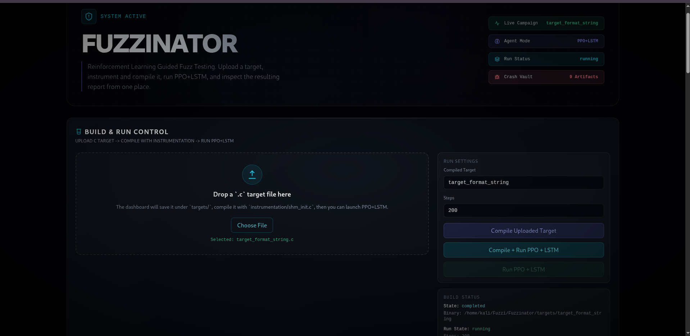
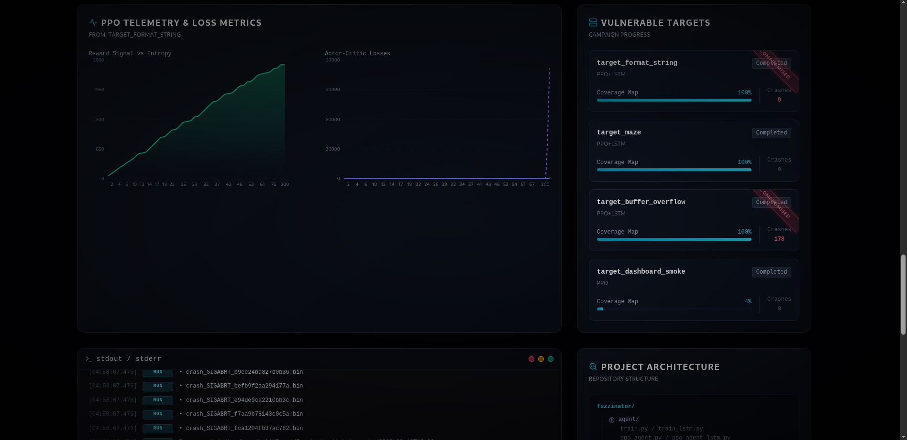
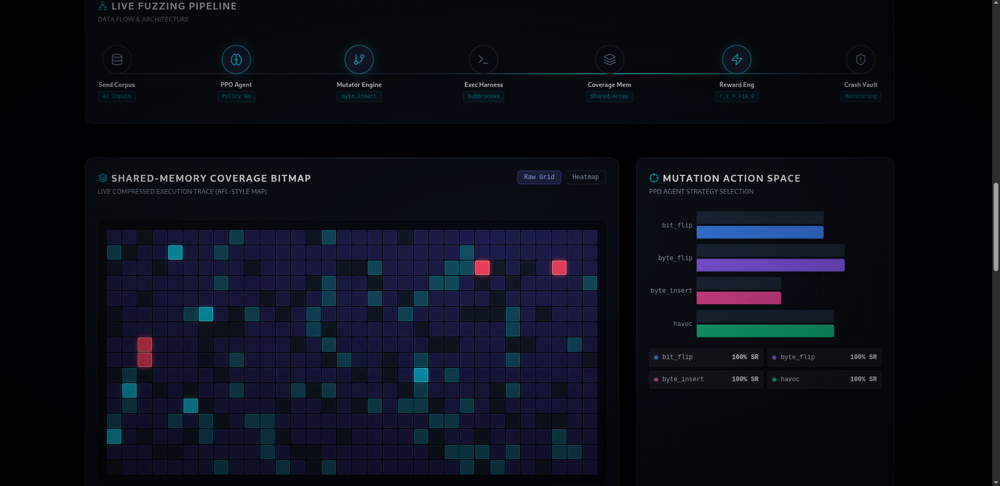
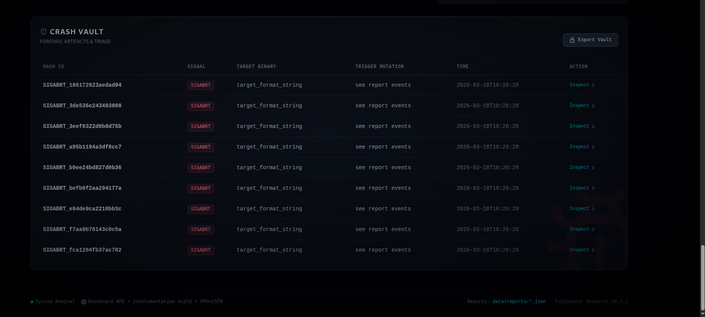
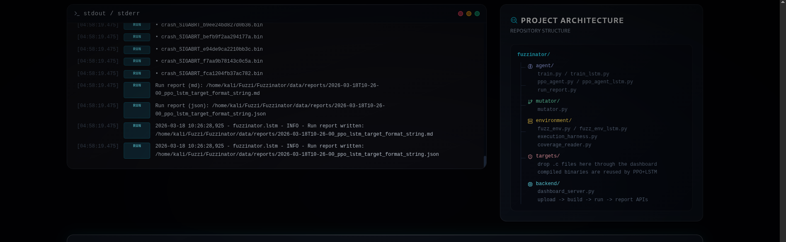

# Fuzzinator — Reinforcement Learning Guided Fuzz Testing

<p align="center">
  <strong>An ML-guided fuzzer that uses PPO + LSTM reinforcement learning to optimize mutation strategies for discovering software vulnerabilities</strong>
</p>

---

## Overview

Fuzzinator is a proof-of-concept demonstrating how **reinforcement learning** can improve software fuzzing. Instead of randomly mutating inputs, a **PPO (Proximal Policy Optimization)** agent — enhanced with an **LSTM** memory layer — learns which mutation strategies are most effective at discovering new code paths and triggering crashes in C target programs.

The project ships with a **real-time web dashboard** that lets you upload targets, compile them with instrumentation, launch fuzzing campaigns, and monitor live results — all from the browser.

## Architecture

```
┌─────────────────────────────────────────────────────────────┐
│                      Training Loop                          │
│                                                             │
│   Seed Input                                                │
│       │                                                     │
│       ▼                                                     │
│   ┌──────────────┐  action   ┌────────────────┐             │
│   │  PPO + LSTM  │──────────▶│    Mutator     │             │
│   │  (PyTorch)   │           │ (4 strategies) │             │
│   └─────▲────────┘           └───────┬────────┘             │
│         │                            │                      │
│         │ reward                     ▼ mutated input        │
│         │                   ┌─────────────────┐             │
│   ┌─────┴──────┐            │  Exec Harness   │             │
│   │   Reward   │            │  (subprocess)   │             │
│   │   Engine   │            └────────┬────────┘             │
│   └─────▲──────┘                     │                      │
│         │                            ▼                      │
│         │ new_edges         ┌──────────────────┐            │
│         │ + crash           │ Coverage Reader  │            │
│         └───────────────────│ (shared memory)  │            │
│                             └────────┬─────────┘            │
│                                      │ crash?               │
│                                      ▼                      │
│                             ┌──────────────────┐            │
│                             │  Crash Vault     │            │
│                             │ (data/crashes/)  │            │
│                             └──────────────────┘            │
└─────────────────────────────────────────────────────────────┘
```

## Components

| Component              | File                                   | Description                                              |
| ---------------------- | -------------------------------------- | -------------------------------------------------------- |
| **PPO Agent**          | `agent/ppo_agent.py`                   | Actor-Critic MLP with clipped PPO                        |
| **PPO+LSTM Agent**     | `agent/ppo_agent_lstm.py`              | Actor-Critic with LSTM memory for temporal reasoning     |
| **Input Encoder**      | `agent/input_encoder.py`               | Encodes raw fuzz inputs into observation vectors         |
| **Rollout Buffer**     | `agent/replay_buffer.py`               | Stores transitions, computes GAE advantages              |
| **LSTM Rollout Buffer**| `agent/replay_buffer_lstm.py`          | Rollout buffer with hidden-state tracking for LSTM       |
| **Reward Engine**      | `agent/reward_engine.py`               | +10 new edge, +100 crash, −0.1 no progress               |
| **Run Report**         | `agent/run_report.py`                  | Generates JSON + Markdown reports after each campaign    |
| **Training Loop**      | `agent/train.py`                       | Main entry point for baseline PPO campaigns              |
| **LSTM Training Loop** | `agent/train_lstm.py`                  | Main entry point for PPO+LSTM campaigns                  |
| **Fuzz Environment**   | `environment/fuzz_env.py`              | Gymnasium env wrapping the fuzz loop                     |
| **LSTM Fuzz Env**      | `environment/fuzz_env_lstm.py`         | Extended env with LSTM-specific state management         |
| **Exec Harness**       | `environment/execution_harness.py`     | Runs targets via subprocess with timeout                 |
| **Coverage Reader**    | `environment/coverage_reader.py`       | Reads shared memory bitmap, tracks edges                 |
| **Crash Vault**        | `environment/crash_vault.py`           | Saves unique crashing inputs                             |
| **Mutator**            | `mutator/mutator.py`                   | 4 strategies: bit_flip, byte_flip, byte_insert, havoc    |
| **Config**             | `config/default.yaml`                  | Central YAML config for agent, environment, and paths    |
| **Dashboard Server**   | `backend/dashboard_server.py`          | REST API — build, run, and monitor campaigns             |
| **Dashboard UI**       | `frontend/Dashboard.html`              | React-based real-time dashboard with live charts         |

## Target Programs

| Target                   | Vulnerability                          | Crash Difficulty |
| ------------------------ | -------------------------------------- | ---------------- |
| `target_buffer_overflow` | Stack buffer overflow via `memcpy`     | Easy             |
| `target_format_string`   | Format string via `printf(user_input)` | Medium           |
| `target_maze`            | Maze requiring specific byte sequence  | Hard             |

## Installation

### Prerequisites

- **Python 3.8+**
- **PyTorch** (CPU or CUDA)
- **Clang** (for instrumenting targets)
- **Linux** (for shared memory and signal handling)

### Setup

```bash
# Clone the project
git clone https://github.com/SainiParv05/Fuzzinator.git
cd Fuzzinator/

# Create and activate a virtual environment
python -m venv venv
source venv/bin/activate

# Install Python dependencies
pip install -r requirements.txt

# Build the instrumented targets
bash instrumentation/build_target.sh
```

### Install Clang (if needed)

```bash
# Debian/Ubuntu/Kali
sudo apt install clang
```

## Usage

### Quick Start (Terminal)

```bash
# Build targets
bash instrumentation/build_target.sh

# Run baseline PPO fuzzer (default: target_buffer_overflow, 2000 steps)
python agent/train.py

# Run the PPO+LSTM fuzzer
python agent/train_lstm.py --target targets/target_buffer_overflow --steps 500
```

### Dashboard GUI

```bash
# Start the dashboard server
python backend/dashboard_server.py
```

Then open **`http://127.0.0.1:8000/Dashboard.html`** in your browser.

The dashboard provides:
- **Drag-and-drop** upload of `.c` target files
- **One-click** compile with instrumentation + run PPO+LSTM
- **Live stats** — coverage edges, crashes, exec/sec, reward, active mutation
- **PPO Telemetry charts** — reward signal, entropy, policy loss, value loss (from real report data)
- **Mutation Action Space** — real distribution of mutation strategies used by the agent
- **Coverage Bitmap** — AFL-style shared memory visualization
- **Run completion banner** — animated notification when a campaign finishes or fails
- **Full run report** — metrics, events, artifact paths, and crash files
- **Target analysis** — progress across all fuzzed targets from previous campaigns
- **Crash Vault** — forensic artifacts from discovered crashes

### Dashboard Screenshots

<p align="center">
  
  <br><em>Main Dashboard — Hero section with live campaign stats and build controls</em>
</p>

<p align="center">
  
  <br><em>Stats Overview — Real-time coverage edges, crashes, exec/sec, reward, and mutation strategy</em>
</p>

<p align="center">
  
  <br><em>Completion Report — Detailed run report with metrics, events, and artifact paths</em>
</p>

<p align="center">
  
  <br><em>Live Fuzzing Pipeline & Coverage Bitmap — Data flow visualization and AFL-style shared memory map</em>
</p>

<p align="center">
  
  <br><em>Crash Vault — Forensic artifact triage with signal type, target, and trigger mutation</em>
</p>

<p align="center">
  
  <br><em>Project Architecture — Repository structure and component map</em>
</p>

### CLI Options

```bash
python agent/train.py --help

# Fuzz a specific target
python agent/train.py --target targets/target_maze

# Run more steps
python agent/train.py --steps 5000

# Change learning rate
python agent/train.py --lr 1e-3

# PPO+LSTM options
python agent/train_lstm.py --target targets/target_maze --steps 1000 --device cpu
```

### Example Output

```
═══════════════════════════════════════════════════════════
 Starting Fuzzing Campaign
═══════════════════════════════════════════════════════════

  Step |   Reward | New  | Total  | Crashes |     Action | Info
--------------------------------------------------------------------------------
    10 |    +10.0 |    1 |     12 |       0 |   bit_flip |
    20 |    -0.1  |    0 |     12 |       0 |      havoc |
    30 |    +20.0 |    2 |     14 |       0 |  byte_flip |
    42 |   +110.0 |    1 |     18 |       1 | byte_insert| 💥 CRASH (SIGSEGV) → saved
       | [PPO UPDATE] | π_loss=0.0234 | v_loss=0.1502 | entropy=1.3412
   ...

═══════════════════════════════════════════════════════════
 Fuzzing Campaign Complete!
═══════════════════════════════════════════════════════════
  Total steps:     2000
  Total time:      45.2s
  Exec speed:      44.2 exec/sec
  Total edges:     47
  Total crashes:   3
  Crash dir:       data/crashes/

  Crashes found:
    • crash_SIGSEGV_a1b2c3d4e5f6g7h8.bin
    • crash_ASAN_f8e7d6c5b4a39281.bin
```

## How It Works

1. **Seed Loading** — The fuzzer starts with an initial seed input (`corpus/seed.bin`)
2. **Input Encoding** — The raw input + coverage state is encoded into a 67-dimensional observation vector
3. **Mutation Selection** — The PPO+LSTM agent observes the coverage state and selects one of 4 mutation strategies. The LSTM layer gives the agent temporal memory across steps
4. **Input Mutation** — The selected strategy mutates the current input
5. **Target Execution** — The mutated input is fed to the instrumented target via subprocess
6. **Coverage Collection** — Edge coverage is read from the shared memory bitmap
7. **Reward Computation** — The agent receives rewards for new coverage (+10/edge) and crashes (+100)
8. **Policy Update** — Every N steps, PPO updates the policy using collected experience with GAE advantages
9. **Crash Storage** — Crashing inputs are saved to `data/crashes/` for later analysis
10. **Report Generation** — A JSON + Markdown report is generated with metrics, events, and artifact paths

## Observation Space

The RL agent receives a 67-dimensional observation vector:

| Index | Description                             |
| ----- | --------------------------------------- |
| 0–63  | Compressed coverage bitmap (64 buckets) |
| 64    | Last mutation action (normalized)       |
| 65    | Current input length (normalized)       |
| 66    | Step count (normalized)                 |

## Reward Function

| Event             | Reward         |
| ----------------- | -------------- |
| New coverage edge | +10.0 per edge |
| Crash detected    | +100.0         |
| No new coverage   | −0.1           |

## Configuration

All settings are centralized in `config/default.yaml`:

```yaml
agent:
  device: cpu
  learning_rate: 3.0e-4
  lstm_hidden: 128
  lstm_layers: 1

environment:
  timeout_ms: 500
  max_input_size: 1024

fuzzing:
  new_edge_reward: 10.0
  crash_reward: 100.0
  buffer_size: 256
  checkpoint_interval: 500
```

## Project Structure

```
fuzzinator/
├── agent/                        # RL agents
│   ├── ppo_agent.py              # Baseline PPO actor-critic
│   ├── ppo_agent_lstm.py         # PPO + LSTM actor-critic
│   ├── input_encoder.py          # Observation encoding
│   ├── replay_buffer.py          # Rollout buffer with GAE
│   ├── replay_buffer_lstm.py     # LSTM-aware rollout buffer
│   ├── reward_engine.py          # Reward computation
│   ├── run_report.py             # JSON + Markdown report generation
│   ├── runtime_utils.py          # Runtime helpers
│   ├── train.py                  # Baseline PPO training loop
│   └── train_lstm.py             # PPO+LSTM training loop
├── environment/                  # Fuzzing environment
│   ├── fuzz_env.py               # Gymnasium environment
│   ├── fuzz_env_lstm.py          # LSTM-extended environment
│   ├── execution_harness.py      # Target execution via subprocess
│   ├── coverage_reader.py        # Coverage bitmap reader
│   └── crash_vault.py            # Crash input storage
├── mutator/                      # Input mutations
│   └── mutator.py                # 4 strategies: bit_flip, byte_flip, byte_insert, havoc
├── config/                       # Configuration
│   ├── __init__.py               # Config loader
│   ├── default.yaml              # Default settings
│   └── logging_setup.py          # Logging configuration
├── backend/                      # Dashboard server
│   └── dashboard_server.py       # REST API for build, run, status, report
├── frontend/                     # Dashboard UI
│   └── Dashboard.html            # React + Tailwind real-time dashboard
├── instrumentation/              # Build tools
│   ├── build_target.sh           # Target compilation with coverage
│   └── shm_init.c                # Shared memory instrumentation
├── targets/                      # Vulnerable C programs
│   ├── target_buffer_overflow.c  # Stack buffer overflow
│   ├── target_format_string.c    # Format string vulnerability
│   └── target_maze.c             # Complex logic maze
├── corpus/                       # Seed inputs
│   └── seed.bin
├── data/                         # Output
│   ├── crashes/                  # Crashing inputs (.bin files)
│   ├── checkpoints/              # Model checkpoints (.pt files)
│   └── reports/                  # Run reports (.json + .md)
├── images/                       # Dashboard screenshots
├── requirements.txt
└── README.md
```

## License

This project is for educational purposes — a college minor project demonstrating RL-guided fuzz testing.
